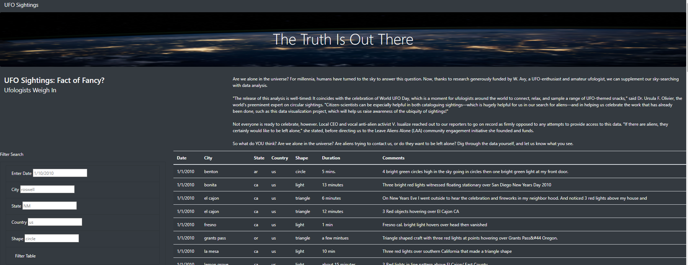

# UFO Sightings: See something strange in the sky?

## Overview
Dana is a science journalist and has reported on UFO sighting reports over the years. She recently came across a large database capturing reported sightings and wants to share the reports in an accessible manner with the wider public.

Dana takes a crash course in JavaScript and HTML to build a searchable dynamic table viewable on the web. We help Dana to create 5 searchable elements to narrow the data table to UFO sightings of interest to the viewer. 

#### Purpose
The purpose of this effort is to share UFO sightings data with the public in a digestible, easy-to-use format. This is accomplished by converting the data into a dynamic table via JavaScript, and then, displaying this data online with HTML. 

## Results
We started this exercise by displaying the data with only one filter (date) or search criteria displayed on the website. We expanded this by adding additional filter criteria to include more search options; available filters now include Date, City, State, Country, and Shape of the reported UFO sightings captured in this database. For the user, these filters do not all need to be completed - rather, the user can filter by as many criteria as they like. 

Here the reported sightings data is filtered by Date, State, Country, and Shape:

## Summary
We were able to support Dana in successfully deploying a user-friendly website displaying UFO sightings. 

The drawback of this site is that it shares data that is not continually refreshed but refers to past data captured in a database. It would be more interesting if the data displayed could be real-time (i.e., sharing ongoing reports of UFO sightings).

### Recommendations 
To further develop this website, Dana should consider a method to modernize the datasource to capture updated data as reported to the database we used in building the website.

Another recommendation is to make the filters more flexible so as to capture potential misspellings on the user-end or via that originally reported to the database. It is likely that there are some mistakes in spelling city names for example. 
